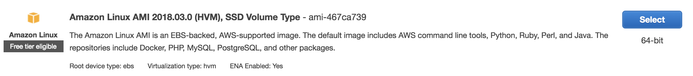

# Provision a VM with EC2

Deploying a web app means making it accessible to the world. This means the web app should run somewhere that users can access it over the internet. This section shows how to provision the [virtual machine](../chapter-1/the-cloud.md) on which your web app will run.

## Create a VPC for your App

1. Navigate to the VPC service in the AWS Web Console.

2. 

## Provision the VM

1. Open the AWS web console and navigate to the EC2 service dashboard.

2. Launch an instance.
    
    * Choose an AMI (Amazon Machine Image). This determines the operating system and applications your virtual machine will be initialized with. Select an Amazon Linux AMI, for example **Amazon Linux AMI 2018.03.0 (HVM), SSD Volume Type** with ID `ami-467ca739`.

    
    
    * Select an instance type. The instance type determines the hardware resources like virtual CPUs, RAM, and storage volumes that are allocated to your virtual machine. Instance types that use more resources generally perform better but cost more. Select an instance type based on the needs of your application. For this tutorial, select **t2.micro**.

    * 

## References

1. https://docs.aws.amazon.com/AWSEC2/latest/UserGuide/concepts.html
2. https://medium.com/aws-activate-startup-blog/practical-vpc-design-8412e1a18dcc